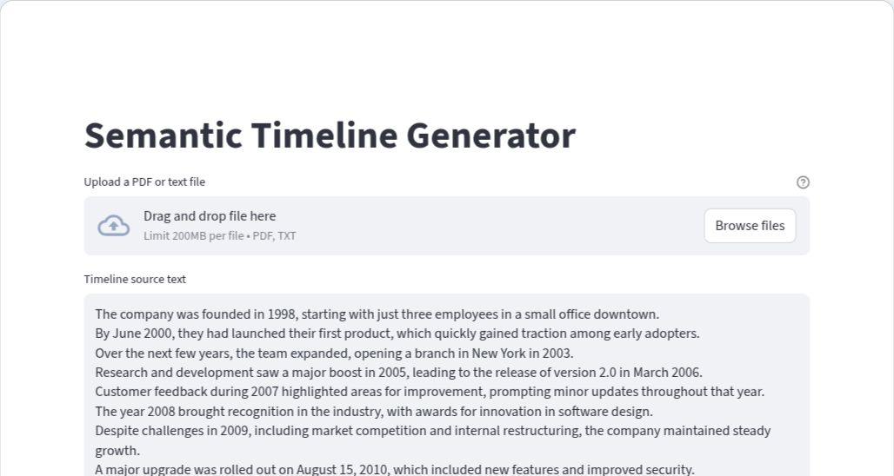
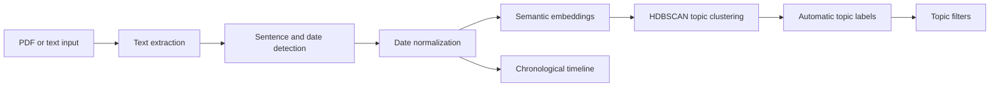

# Semantic Timeline Generator

[](https://www.python.org/)
[](https://semantictimelinegenerator-a7fwnujyubkvpcimsrycb6.streamlit.app/)
[](LICENSE)

Semantic Timeline Generator turns narrative text and selectable-text PDFs into an interactive chronology. It extracts dated events, normalizes their dates, groups semantically related events, generates topic labels, and presents the result as both a filterable topic view and a visual timeline.

**[Open the live demo](https://semantictimelinegenerator-a7fwnujyubkvpcimsrycb6.streamlit.app/)**



## Why This Project

Dates in long documents are easy to find but difficult to interpret in context. This project explores a document-intelligence pipeline that answers two complementary questions:

- What happened, and when?
- Which events belong to the same themes?

It works best with chronological narratives such as company histories, biographies, project reports, incident reports, and case studies.

## How It Works



## Features

- Upload `.pdf` and `.txt` documents or edit the extracted text directly.
- Extract dated event sentences with spaCy and `dateparser`.
- Preserve year, month, and day granularity when dates are available.
- Represent events with SentenceTransformer embeddings.
- Discover event groups without predefining the number of topics using HDBSCAN.
- Generate short labels for discovered topics.
- Explore all events chronologically with an interactive timeline.

## Quick Start

### Prerequisites

- Python 3.12
- Git

Python 3.12 is recommended because the transformer-based spaCy dependencies may require local compilation on newer Python versions.

### Installation

```bash
git clone https://github.com/ashimaryal25-ops/Semantic_Timeline_Generator.git
cd Semantic_Timeline_Generator
python -m venv .venv
```

Activate the virtual environment on Windows:

```powershell
.\.venv\Scripts\Activate.ps1
```

On macOS or Linux:

```bash
source .venv/bin/activate
```

Install dependencies and start the app:

```bash
python -m pip install --upgrade pip
python -m pip install -r requirements.txt
streamlit run semantic_timeline_3.py
```

The initial installation is large because the application uses transformer-based NLP models.

## Choosing Good Input

Good input connects dates to concrete events:

```text
In 1936, Riken Kankoshi Co., Ltd. was established.
The company entered the business machine field in 1955.
In 2000, the organization expanded its global operations.
```

Academic papers, reference lists, financial tables, and image-only scans may produce noisy or incomplete timelines. Uploaded PDFs must contain selectable text; optical character recognition is not currently included.

## Technical Architecture

| Stage | Implementation |
| --- | --- |
| Document parsing | `pypdf` |
| Sentence and date entity detection | spaCy `en_core_web_trf` |
| Date parsing and normalization | `dateparser` |
| Semantic representation | `all-MiniLM-L6-v2` SentenceTransformer |
| Topic discovery | HDBSCAN over normalized embeddings |
| Topic labeling | T5 summarization pipeline |
| Interface and visualization | Streamlit and `streamlit-timeline` |

## Project Structure

```text
Semantic_Timeline_Generator/
|-- semantic_timeline_3.py                  # Current Streamlit application
|-- semantic-timeline-2.py                  # Earlier timeline prototype
|-- semantic-timeline-1-event-extraction.py # Initial extraction experiment
|-- requirements.txt
|-- CONTRIBUTING.md
|-- docs/assets/app-preview.png
|-- .github/                              # Issue and pull request templates
|-- LICENSE
`-- README.md
```

## Current Limitations

- Image-only PDFs require OCR before upload.
- Repeated headers, footers, citations, and standalone date ranges can be mistaken for events.
- Topic labels can become overly specific when a cluster contains very few events.
- Large documents are computationally expensive because event extraction and embedding run locally.
- The project does not yet include a labeled evaluation dataset or extraction-quality metrics.

## Roadmap

- Filter repeated PDF headers, footers, and date-range navigation text.
- Deduplicate repeated events and retain PDF page references.
- Add event confidence scores and an editable review step.
- Improve topic naming and merge undersized clusters.
- Add CSV and JSON exports.
- Build a labeled evaluation set and automated test suite.

## Contributing

Bug reports, focused improvements, and documentation updates are welcome. Read [CONTRIBUTING.md](CONTRIBUTING.md) before opening a pull request.

## License

Distributed under the [MIT License](LICENSE).
